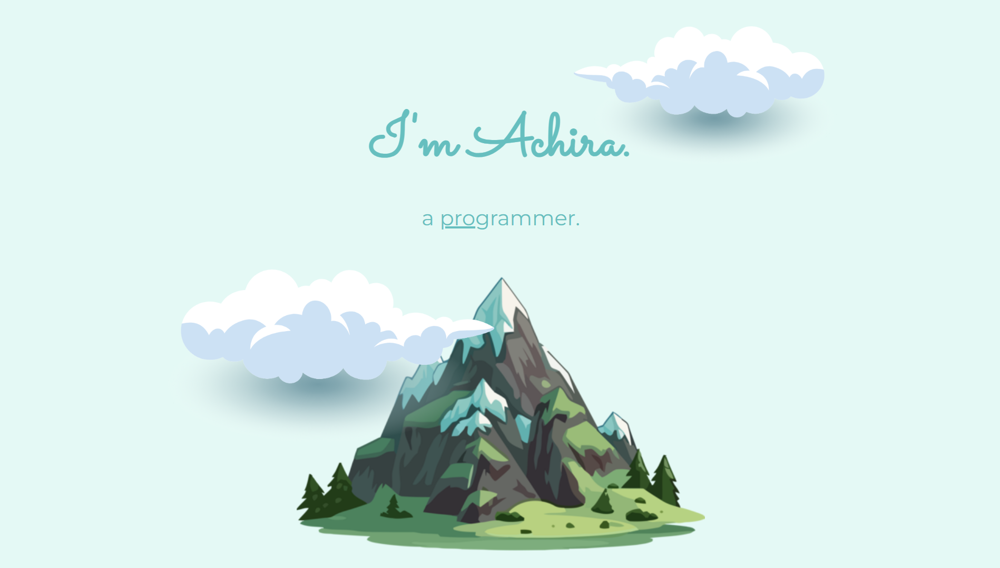
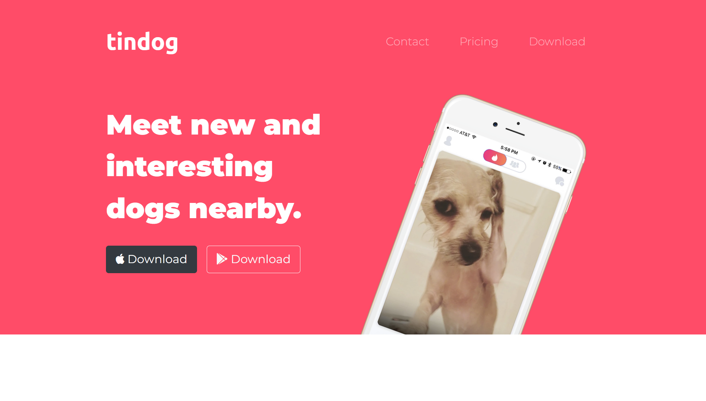
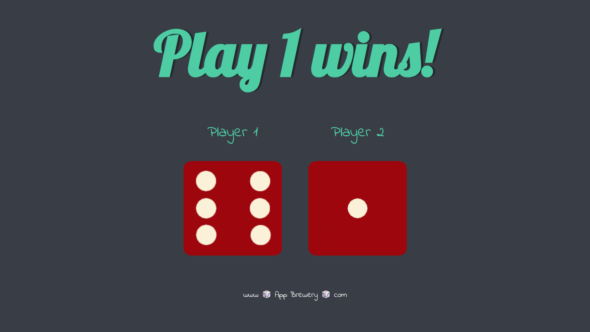
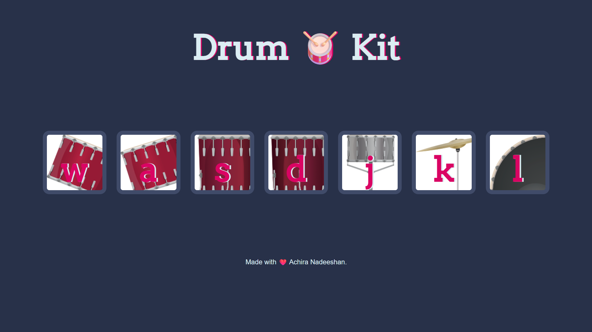
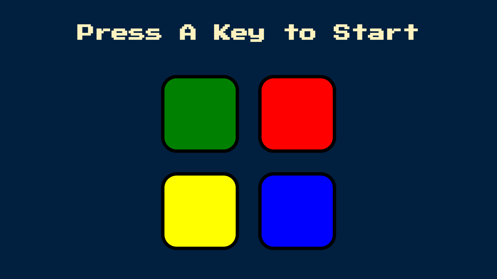
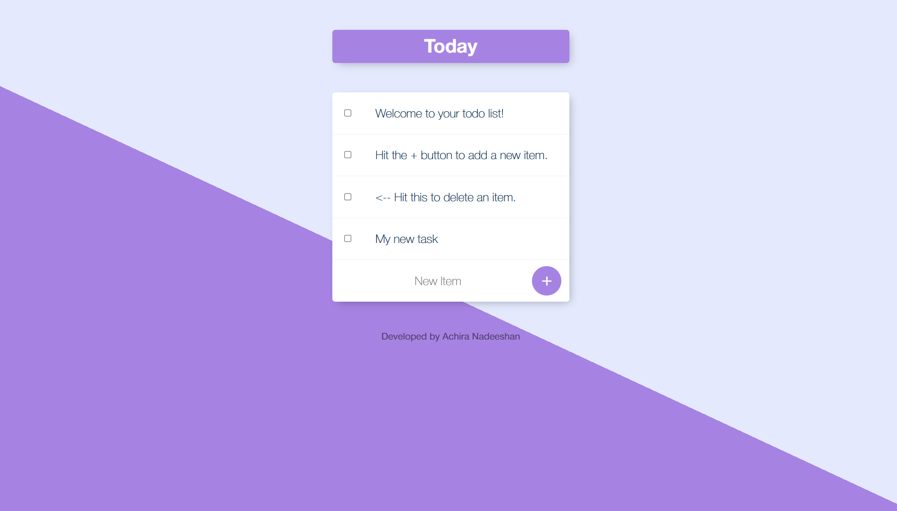
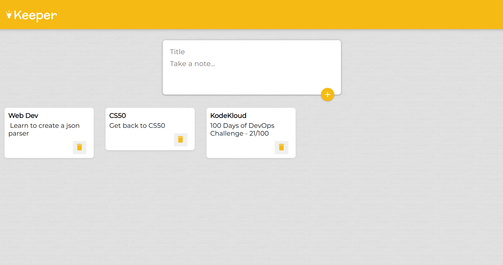
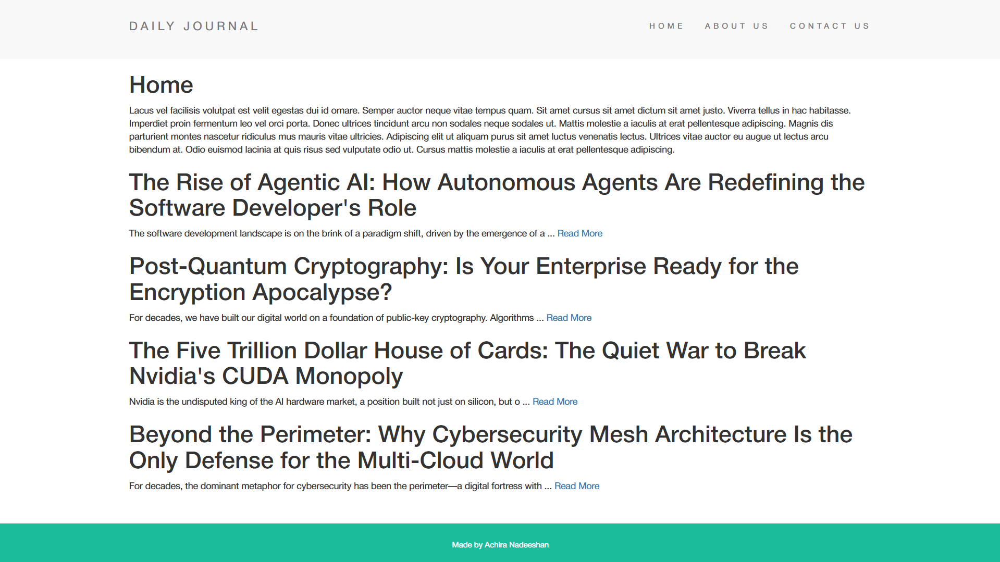

# My Journey Through The Complete Full-Stack Web Development Bootcamp Course

This repository documents my entire journey through **Dr. Angela Yu's Complete Web Development Bootcamp**. It serves as a personal archive of all the projects, challenges, and notes I've completed while mastering the world of web development.

This course was a fantastic experience. Everything was explained clearly and concisely, making complex topics feel simple and accessible. It covered a huge range of tools and technologies, taking me from the very basics of HTML to building my own full-stack web applications. I would wholeheartedly recommend this course to anyone, even with zero prior programming experience, who wants to start a journey in web development.

- **Course Link:** [The Complete Web Development Bootcamp](https://www.udemy.com/course/the-complete-web-development-bootcamp/)
- **Course Resources:** [App Brewery Course Resources](https://www.appbrewery.com/p/web-development-course-resources)

## What I Learned

This course provided a comprehensive curriculum covering the full stack. Here are the key technologies and concepts I mastered:

### Front-End Web Development
- **HTML 5:** The structure and foundation of web pages.
- **CSS 3:** Styling and designing beautiful websites, including Flexbox, Grid, and responsive design.
- **Bootstrap 4:** Building responsive, mobile-first layouts with a modern UI framework.
- **JavaScript ES6:** Programming logic, interactivity, and modern features of the language.
- **DOM Manipulation:** Interacting with and dynamically changing website content.
- **jQuery:** Simplifying DOM manipulation and event handling (still a valuable skill!).
- **React.js:** Building complex, stateful, and reusable UI components with a modern JavaScript library.
- **Web Design:** Principles of UI/UX and creating visually appealing user experiences.

### Back-End Web Development & Databases
- **Node.js:** Running JavaScript on the server to build fast and scalable applications.
- **NPM (Node Package Manager):** Managing project dependencies and scripts.
- **Express.js:** A minimal and flexible Node.js web application framework.
- **EJS (Embedded JavaScript):** Creating dynamic HTML templates on the server.
- **RESTful APIs:** Designing and building APIs for client-server communication.
- **Databases:** Understanding and working with relational (SQL) and non-relational (NoSQL) databases.
- **MongoDB & Mongoose:** A popular NoSQL database and an elegant object data modeling (ODM) library to interact with it.

### Tools & Deployment
- **Bash Command Line:** Navigating and managing files efficiently from the terminal.
- **Git & GitHub:** Essential version control for tracking changes and collaborating on projects.
- **Deployment:** Bringing projects to life by deploying them on services like **GitHub Pages**, **Heroku**, and **MongoDB Atlas**.

## Project Showcase

This repository contains over 15 projects, each one building on the last. Here are a few highlights that I'm particularly proud of.

### 1. Portfolio (Project 04)
A personal portfolio website built to showcase my skills and projects. This was a foundational project focusing on pure HTML and advanced CSS, including layout techniques, responsive design, and custom fonts to create a clean and professional online presence.

### 2. TinDog (Project 06)
A fun, responsive landing page for a fictional "Tinder for dogs" startup. This project was a deep-dive into the Bootstrap framework, focusing on responsive design, pricing tables, carousels, and testimonials.

### 3. The Dice Game (Project 08)
A simple but fun two-player dice game. This project was a great introduction to DOM manipulation with JavaScript. On every refresh, the dice are rolled, and a winner is declared based on the outcome, demonstrating the use of random number generation and dynamically updating content and images.

### 4. The Drum Kit (Project 09)
An interactive drum kit that plays sounds in response to user actions. This project solidified my understanding of JavaScript event listeners, responding to both mouse clicks and keyboard presses. It also involved using JavaScript to play audio and add animations for a more engaging user experience.

### 5. The Simon Game (Project 11)
A digital recreation of the classic "Simon" memory game. This project was a fantastic challenge in JavaScript and jQuery, involving complex game logic, event handling, and playing sounds to create an interactive user experience.

### 6. To-Do List (Project 20)
A full-stack to-do list application built with Node.js, Express, and EJS. This was a major project that introduced me to back-end development, templating, and working with a MongoDB database to persist user data, including custom lists.

### 7. Keeper App (Project 24)
A clone of Google Keep built with React. This was my introduction to the world of modern front-end frameworks. I learned about components, props, state management, and how to build a dynamic and interactive single-page application (SPA).

### 8. Blog Website (Project 25)
A complete, database-driven blog website. This project tied everything together: EJS templating for the front-end, Node.js and Express for the back-end, and MongoDB for storing posts. Users can view all posts, read individual entries, and compose new ones.

## Repository Structure

The folders in this repository are numbered based on the **order in which they were built during the course**, not the lesson numbers themselves. Each folder contains the complete **source code, assets, and resources** related to that specific lesson or project.

## Final Thoughts

This has been an incredible learning experience. A huge thank you to **Dr. Angela Yu** and the **App Brewery** team for creating such a high-quality and engaging course.

Feel free to explore, learn, and get inspired. 🚀
